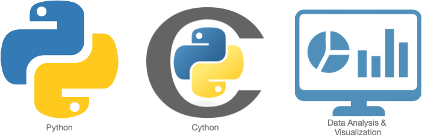
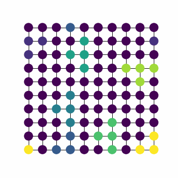
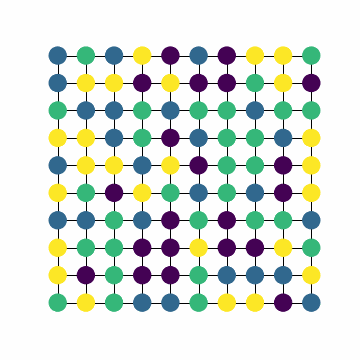

## Portfolio

---

### About Me

I graduated the Msc. Computational Sciences at the University of Amsterdam in 2021 with a GPA of 7.7 (out of 10). Furthermore I did a bachelor in Biomedical Sciences. 

Since I started a minor in programming during my Bsc. Biomedical Sciences I got intrigued by Data Science and the impact of data-driven choices. This is why I taught myself to program and started a Msc. in Computational Sciences. During this master I focussed on Network Modelling, Data Mining, Complex System Simualtion and Stochastic Similations. 

<!--  -->
---

### Education & Skills
- Education:
 -  Msc. Computational Sciences
 -  Bsc. Biomedical Sciences
 
- Programming languages 

 - SQL, R and HTML
  
- Skills
  - Analytic Thinking
  - Monte Carlo Methods, Markov Chains and Poisson Processes
  - Complex System Simulations
  - Statistics
  - Data Mining Techniques

---

### Projects

- Modelling Value Networks on Lattice Networks
During my MSc. Computational Sciences I investigated the stability of different value network configurations in a larger network.
 
<!--   -->

- NLP Kaggle project

---

### Sports

---

Page template forked from <a href="https://github.com/evanca/quick-portfolio">evanca</a>

<!-- Remove above link if you don't want to attibute -->
